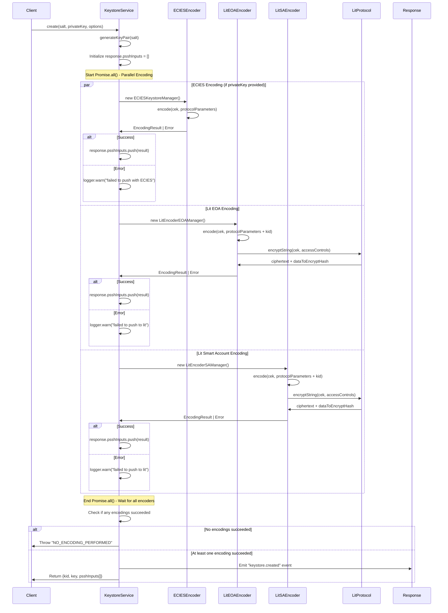
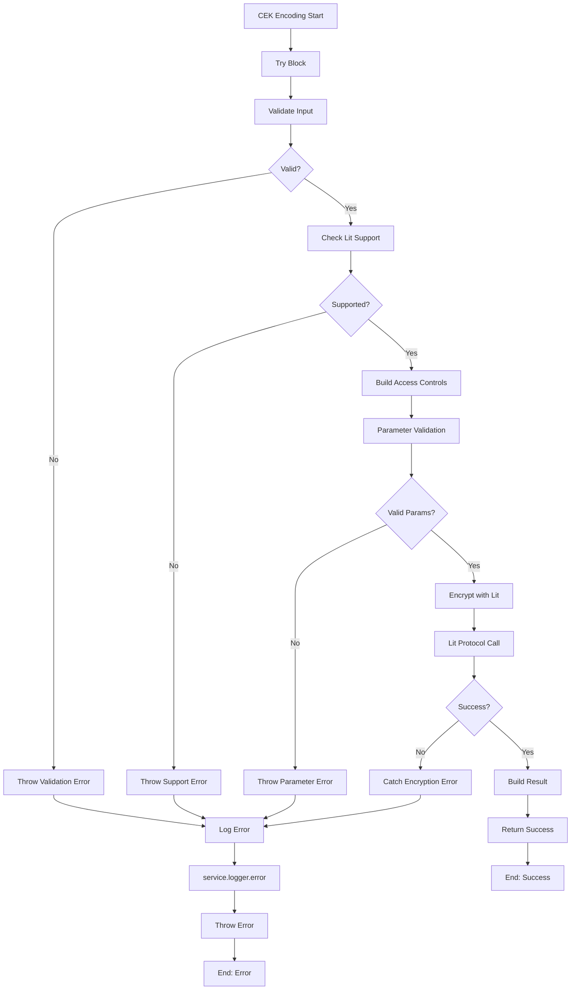

## Overview

This document provides a comprehensive technical overview of the Content Encryption Key (CEK) encoding process in the lit-keystore-moleculer service, including the architectural changes introduced in ELACITY-2010 to support Smart Account operations.

## What is CEK (Content Encryption Key)?

A **Content Encryption Key (CEK)** is a symmetric cryptographic key used to encrypt/decrypt the actual content data. In the Lit Protocol context, the CEK is:

- **Generated randomly** for each encryption operation
- **Used to encrypt the actual content** using symmetric encryption (fast)
- **Itself encrypted using Lit Protocol** with access control conditions
- **Stored alongside the encrypted content** for later decryption

## Architecture Overview

The refactor introduced a **factory pattern** that creates specialized encoders while sharing core CEK encoding logic:

```tsx
// Factory approach introduced in ELACITY-2010 as we 
// would be able to have multiple Lit encoder
// each with their own purpose
LitEncoderEOA = createLitEncoder({
  keySystemId: KeySystemId.CencDRM_LitV1,  
  protectionType: ProtectionType.CencDRM_LitV1,  
  actionIpfsId: "QmQgw91ZjsT1VkhxtibNV4zMet6vQTtQwL4FK5cRA8xHim",  
  accessCheckIpfsId: "QmVdU5MhsQg5mhZNNmp3qx3bbuGw6FPrUGws1yUycY9vsS"
});
```

## Complete CEK Encoding Flow



## Key Components Deep Dive

### Access Control Template Structure

The access control template is built during initialization and defines the conditions for CEK decryption:

```tsx
{
  unifiedAccessControlConditions: [
    {
	    // This part ensure only the predefined lit action (by its ipfs cid)
	    // can be executed to make the decryption
      conditionType: "evmBasic",
      contractAddress: "",
      standardContractType: "",
      chain: ":chain",
      method: "",
      parameters: [":currentActionIpfsId"],
      returnValueTest: {
        comparator: "=",
        value: ":actionIpfsId",
       },
    },
    { operator: "and" },
    {
		   // this part ensure the current user
		   // have the rights to access the media identified
		   // by the KID
		   // `:userAddress` is automatically resolved in the Lit 
		   // execution runtime
		   // For the specific case of SA (use different CID than the EOA method),
		   // the userAddress (EOA) will be derivated to get the SA address
	     conditionType: "evmBasic",
	     contractAddress: `ipfs://${accessCheckIpfsId}`,
	     standardContractType: "LitAction",
	     chain: ":chain",
	     method: "hasAccessByContentId",
	     parameters: [":userAddress", ":kid", ":authority", ":rpc"],
	     returnValueTest: { comparator: "=", value: "true" }
	  },
	]
}
```

## EOA vs Smart Account Differences

### Configuration Differences

| Aspect | EOA | Smart Account |
| --- | --- | --- |
| **Key System ID** | `CencDRM_LitV1` | `CencDRM_LitSAV1` |
| **Protection Type** | `CencDRM_LitV1` | `CencDRM_LitSAV1` |
| **Action IPFS ID** | `QmQgw91ZjsT1VkhxtibNV4zMet6vQTtQwL4FK5cRA8xHim` | `QmWDBNCk1xHk8giLn1cxFrBke7aPFTuXsMDsnn9Pom1wZu` |
| **Access Check IPFS ID** | `QmVdU5MhsQg5mhZNNmp3qx3bbuGw6FPrUGws1yUycY9vsS` | `QmayEHFfJiZbryYyCsUUEu4drhhDM4FkmxM6RZMcy67zHP` |

## Error Handling Flow



## Security Considerations

### Input Sanitization

1. **Parameter Key Validation**: Ensures only alphanumeric keys with underscores
2. **Address Validation**: Strict Ethereum address format checking
3. **URL Validation**: RPC URL format verification
4. **Injection Prevention**: Character filtering to prevent injection attacks

### Access Control Security

1. **Template Immutability**: Access control templates are read-only after initialization
2. **Parameter Isolation**: Each encoding operation uses isolated parameter sets
3. **Chain Validation**: Chain names are validated against supported chains
4. **IPFS Content Verification**: Action and access check IDs are pre-validated

## Troubleshooting Guide

### Common Issues

1. **“Authority does not support Lit Protocol”**
    
    ```tsx
    // Check if contract implements supportsLitProtocol()await authorityContract.supportsLitProtocol(); // Should return true
    ```
    
2. **“Invalid parameter validation”**
    
    ```tsx
    	// Ensure parameters meet validation requirements
    const validParams = {
      chain: "ethereum", // alphanumeric only  
      authority: "0x...", // valid Ethereum address  
      userAddress: "0x...", // valid Ethereum address  
      kid: "0x...", // 32-byte hex string  
      rpc: "https://..." // valid HTTPS URL
    };
    ```
    
3. **“Lit Protocol encryption failed”**
    - Check network connectivity to Lit nodes
    - Verify access control conditions are valid
    - Ensure sufficient gas for blockchain calls

## Future Enhancements

### Potential Improvements

1. **Caching Layer**: Cache authority support checks
2. **Batch Processing**: Support multiple CEK encodings in single call
3. **Parameter Presets**: Pre-configured parameter templates
4. **Monitoring**: Enhanced metrics and monitoring
5. **Multi-Chain**: Extended support for additional blockchain networks

### Extensibility Points

1. **Custom Validators**: Pluggable parameter validation
2. **Template Extensions**: Custom access control templates
3. **Encoder Variants**: Additional encoder types beyond EOA/SA
4. **Integration Hooks**: Pre/post processing hooks

## Conclusion

The CEK encoding process in lit-keystore-moleculer provides a robust, secure, and extensible foundation for content encryption using the Lit Protocol. The ELACITY-2010 refactor successfully introduced Smart Account support while maintaining backward compatibility and enhancing the overall architecture for future extensibility.