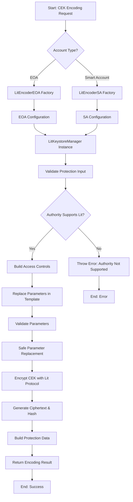
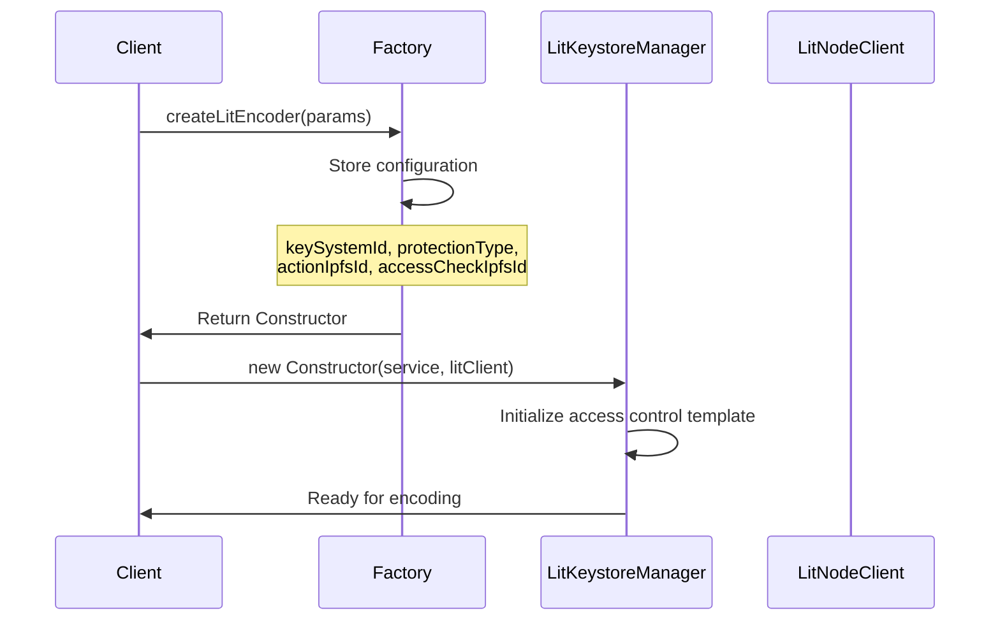
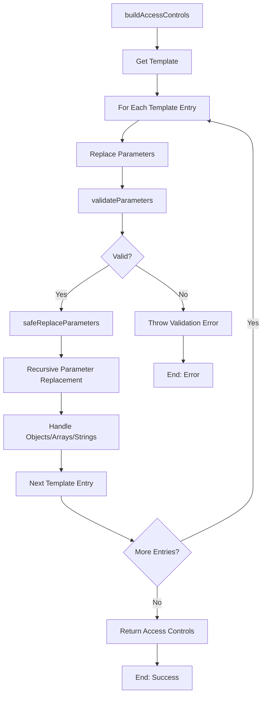
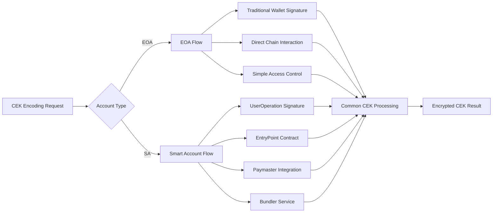
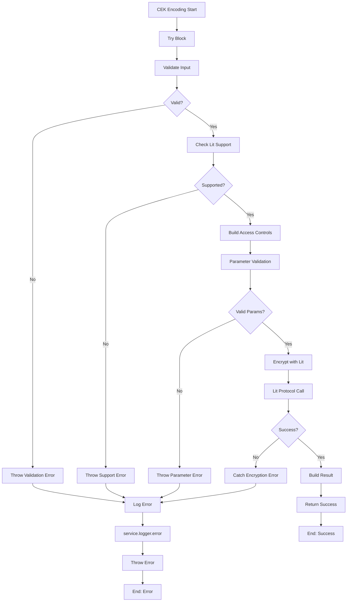

# Content Encryption Key (CEK) Encoding Process Documentation

## Overview

This document provides a comprehensive technical overview of the Content Encryption Key (CEK) encoding process in the lit-keystore-moleculer service, including the architectural changes introduced in ELACITY-2010 to support Smart Account operations.

## What is CEK (Content Encryption Key)?

A **Content Encryption Key (CEK)** is a symmetric cryptographic key used to encrypt/decrypt the actual content data. In the Lit Protocol context, the CEK is:

- **Generated randomly** for each encryption operation
- **Used to encrypt the actual content** using symmetric encryption (fast)
- **Itself encrypted using Lit Protocol** with access control conditions
- **Stored alongside the encrypted content** for later decryption

## Architecture Overview

### ELACITY-2010 Changes

The refactor introduced a **factory pattern** that creates specialized encoders while sharing core CEK encoding logic:

```typescript
// Factory approach introduced in ELACITY-2010
LitEncoderEOA = createLitEncoder({
  keySystemId: KeySystemId.CencDRM_LitV1,
  protectionType: ProtectionType.CencDRM_LitV1,
  actionIpfsId: "QmQgw91ZjsT1VkhxtibNV4zMet6vQTtQwL4FK5cRA8xHim",
  accessCheckIpfsId: "QmVdU5MhsQg5mhZNNmp3qx3bbuGw6FPrUGws1yUycY9vsS"
});

LitEncoderSA = createLitEncoder({
  keySystemId: KeySystemId.CencDRM_LitSAV1,
  protectionType: ProtectionType.CencDRM_LitSAV1,
  actionIpfsId: "QmWDBNCk1xHk8giLn1cxFrBke7aPFTuXsMDsnn9Pom1wZu",
  accessCheckIpfsId: "QmayEHFfJiZbryYyCsUUEu4drhhDM4FkmxM6RZMcy67zHP"
});
```

## Complete CEK Encoding Flow



## Detailed Process Steps

### 1. Factory Initialization



### 2. CEK Encoding Process

```mermaid
flowchart TD
    A[encode(cek, protection)] --> B[Validate Protection Input]
    B --> C{Protection Required?}
    C -->|No| D[Throw Error]
    C -->|Yes| E[Check Lit Protocol Support]
    
    E --> F[Contract.supportsLitProtocol()]
    F --> G{Supported?}
    G -->|No| H[Log Warning & Throw Error]
    G -->|Yes| I[Build Access Controls]
    
    I --> J[Get Access Control Template]
    J --> K[Replace Parameters]
    K --> L[Validate Parameters]
    L --> M[Safe Parameter Replacement]
    
    M --> N[Encrypt String with Lit]
    N --> O[encryptString API Call]
    O --> P[Generate Ciphertext & Hash]
    P --> Q[Build Protection Data]
    Q --> R[Return Encoding Result]
    
    D --> S[Error End]
    H --> S
    R --> T[Success End]
```

### 3. Access Control Building



## Key Components Deep Dive

### Access Control Template Structure

The access control template is built during initialization and defines the conditions for CEK decryption:

```typescript
{
  unifiedAccessControlConditions: [
    {
      conditionType: "evmBasic",
      contractAddress: "",
      standardContractType: "",
      chain: ":chain",
      method: "",
      parameters: [":currentActionIpfsId"],
      returnValueTest: {
        comparator: "=",
        value: ":actionIpfsId",
      },
    },
    { operator: "and" },
    {
      conditionType: "evmBasic",
      contractAddress: `ipfs://${accessCheckIpfsId}`,
      standardContractType: "LitAction",
      chain: ":chain",
      method: "hasAccessByContentId",
      parameters: [":userAddress", ":kid", ":authority", ":rpc"],
      returnValueTest: { comparator: "=", value: "true" }
    },
  ],
}
```

### Parameter Validation & Security

```mermaid
flowchart TD
    A[validateParameters] --> B{Check Parameter Key}
    B --> C[Regex: ^[a-zA-Z][a-zA-Z0-9_]*$]
    C --> D{Valid Key?}
    D -->|No| E[Throw Invalid Key Error]
    D -->|Yes| F{Parameter Type?}
    
    F -->|chain| G[Validate Chain Name]
    F -->|authority/userAddress| H[Validate Ethereum Address]
    F -->|kid| I[Validate KID Format]
    F -->|rpc| J[Validate RPC URL]
    F -->|other| K[Generic Validation]
    
    G --> L[Regex: ^[a-zA-Z][a-zA-Z0-9]*$]
    H --> M[Regex: ^0x[a-fA-F0-9]{40}$]
    I --> N[Regex: ^0x[a-fA-F0-9]{32}$]
    J --> O[Regex: ^https?://.*$]
    K --> P[Check for Injection Chars]
    
    L --> Q{Valid?}
    M --> Q
    N --> Q
    O --> Q
    P --> Q
    
    Q -->|No| R[Throw Validation Error]
    Q -->|Yes| S[Add to Validated Params]
    S --> T[Next Parameter]
    T --> U{More Parameters?}
    U -->|Yes| B
    U -->|No| V[Return Validated Parameters]
    
    E --> W[End: Error]
    R --> W
    V --> X[End: Success]
```

## EOA vs Smart Account Differences

### Configuration Differences

| Aspect | EOA | Smart Account |
|--------|-----|---------------|
| **Key System ID** | `CencDRM_LitV1` | `CencDRM_LitSAV1` |
| **Protection Type** | `CencDRM_LitV1` | `CencDRM_LitSAV1` |
| **Action IPFS ID** | `QmQgw91ZjsT1VkhxtibNV4zMet6vQTtQwL4FK5cRA8xHim` | `QmWDBNCk1xHk8giLn1cxFrBke7aPFTuXsMDsnn9Pom1wZu` |
| **Access Check IPFS ID** | `QmVdU5MhsQg5mhZNNmp3qx3bbuGw6FPrUGws1yUycY9vsS` | `QmayEHFfJiZbryYyCsUUEu4drhhDM4FkmxM6RZMcy67zHP` |

### Runtime Flow Differences



## Error Handling Flow



## Performance Characteristics

### CEK Encoding Performance

```mermaid
gantt
    title CEK Encoding Performance Timeline
    dateFormat X
    axisFormat %s

    section Validation
    Input Validation    :0, 10
    Lit Support Check  :10, 50
    
    section Access Control
    Template Processing :50, 80
    Parameter Validation :80, 100
    Parameter Replacement :100, 130
    
    section Encryption
    Lit Protocol Call   :130, 300
    Result Generation   :300, 320
    
    section Completion
    Protection Data Build :320, 340
    Return Result       :340, 350
```



### Memory Usage Patterns

- **Template Storage**: ~1-2KB per encoder instance
- **Parameter Validation**: ~500B-1KB temporary allocation
- **Encryption Operation**: ~2-5KB depending on access control complexity
- **Result Generation**: ~1-3KB for protection data structure

## Security Considerations

### Input Sanitization

1. **Parameter Key Validation**: Ensures only alphanumeric keys with underscores
2. **Address Validation**: Strict Ethereum address format checking
3. **URL Validation**: RPC URL format verification
4. **Injection Prevention**: Character filtering to prevent injection attacks

### Access Control Security

1. **Template Immutability**: Access control templates are read-only after initialization
2. **Parameter Isolation**: Each encoding operation uses isolated parameter sets
3. **Chain Validation**: Chain names are validated against supported chains
4. **IPFS Content Verification**: Action and access check IDs are pre-validated

## Troubleshooting Guide

### Common Issues

1. **"Authority does not support Lit Protocol"**
   ```typescript
   // Check if contract implements supportsLitProtocol()
   await authorityContract.supportsLitProtocol(); // Should return true
   ```

2. **"Invalid parameter validation"**
   ```typescript
   // Ensure parameters meet validation requirements
   const validParams = {
     chain: "ethereum", // alphanumeric only
     authority: "0x...", // valid Ethereum address
     userAddress: "0x...", // valid Ethereum address
     kid: "0x...", // 32-byte hex string
     rpc: "https://..." // valid HTTPS URL
   };
   ```

3. **"Lit Protocol encryption failed"**
   - Check network connectivity to Lit nodes
   - Verify access control conditions are valid
   - Ensure sufficient gas for blockchain calls

### Debug Information

Enable debug logging:
```bash
DEBUG=lit-keystore:* node your-app.js
```

Expected log output:
```
lit-keystore:info Generating access control conditions...
lit-keystore:info Encrypting CEK with Lit Protocol
lit-keystore:info CEK encoding completed successfully
```

## Future Enhancements

### Potential Improvements

1. **Caching Layer**: Cache authority support checks
2. **Batch Processing**: Support multiple CEK encodings in single call
3. **Parameter Presets**: Pre-configured parameter templates
4. **Monitoring**: Enhanced metrics and monitoring
5. **Multi-Chain**: Extended support for additional blockchain networks

### Extensibility Points

1. **Custom Validators**: Pluggable parameter validation
2. **Template Extensions**: Custom access control templates
3. **Encoder Variants**: Additional encoder types beyond EOA/SA
4. **Integration Hooks**: Pre/post processing hooks

## Conclusion

The CEK encoding process in lit-keystore-moleculer provides a robust, secure, and extensible foundation for content encryption using the Lit Protocol. The ELACITY-2010 refactor successfully introduced Smart Account support while maintaining backward compatibility and enhancing the overall architecture for future extensibility.
