## Overview

This document provides a comprehensive view of the complete content protection ecosystem, combining the **CEK encoding process** from the lit-keystore-moleculer service with the **decryption workflow** from the media-player, showing how encrypted content flows from creation to consumption.

## Complete System Architecture

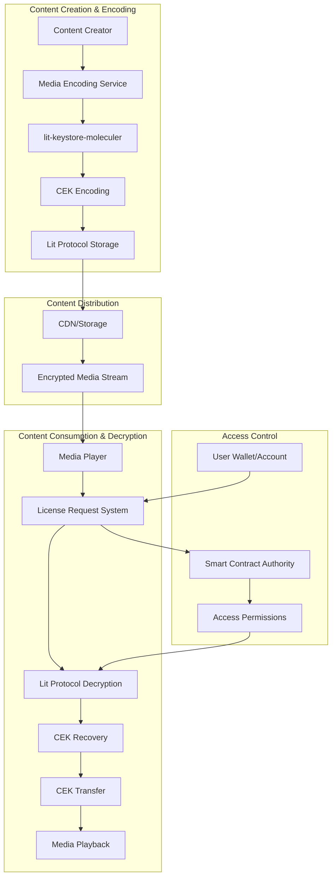

## Encoding to Decryption Flow

### Phase 1: Content Encoding (Case of Lit Protocol encoding process)

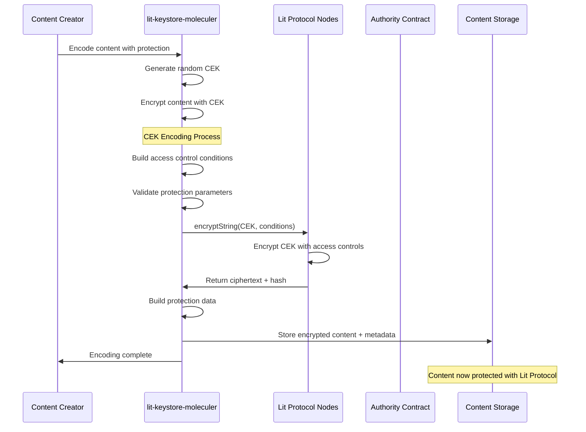

### Phase 2: Content Access & Decryption (media-player)

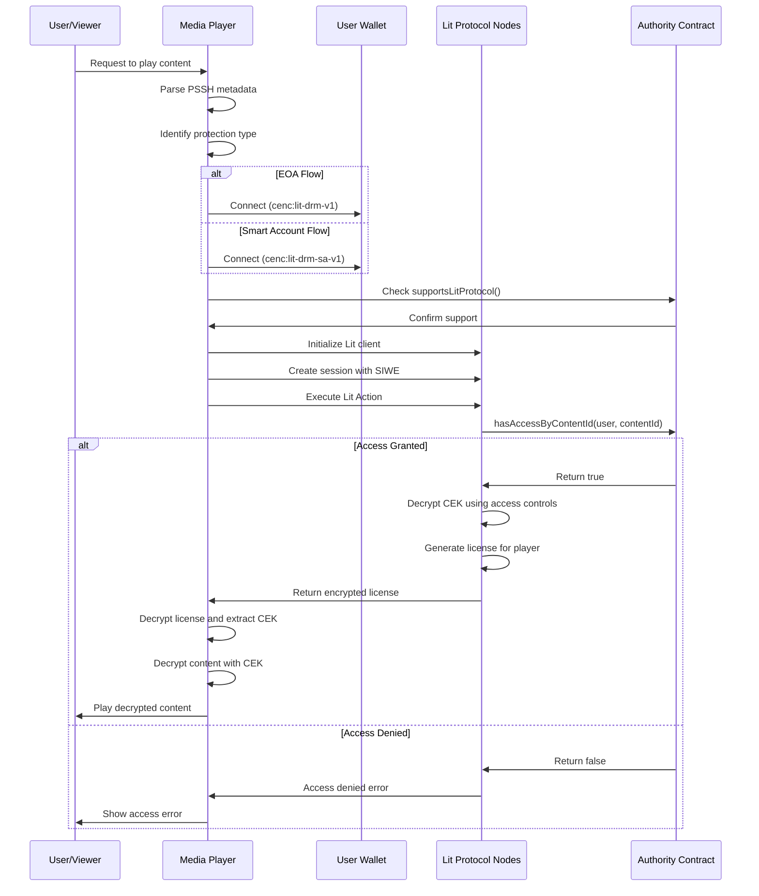

## Account Type Handling

### EOA (Externally Owned Account) Flow

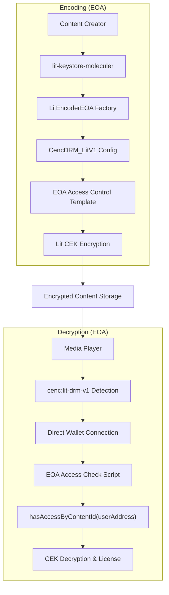

### Smart Account Flow

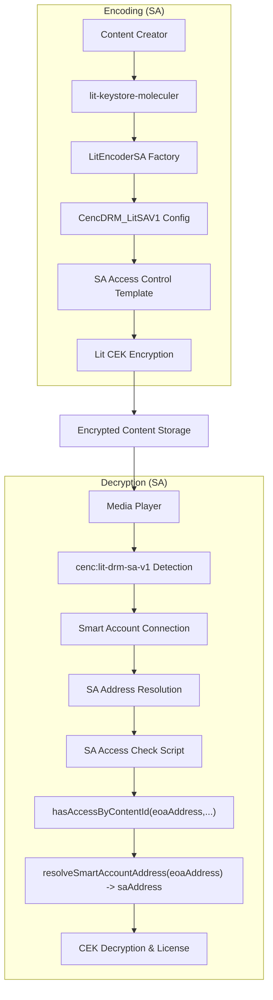

## Data Flow and Format Evolution

### PSSH Box Structure

The PSSH (Protection System Specific Header) box contains the protection metadata:

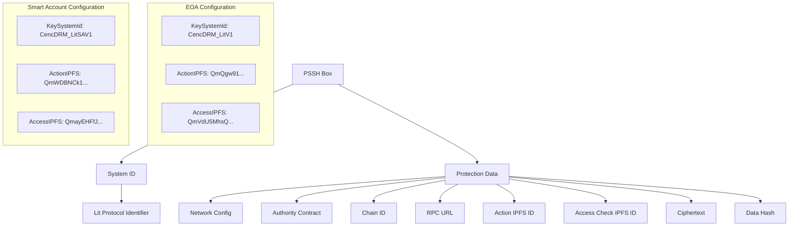

### License Data Format

The media player receives a structured license format:

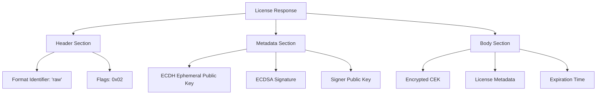

## Security Model

### Access Control Verification

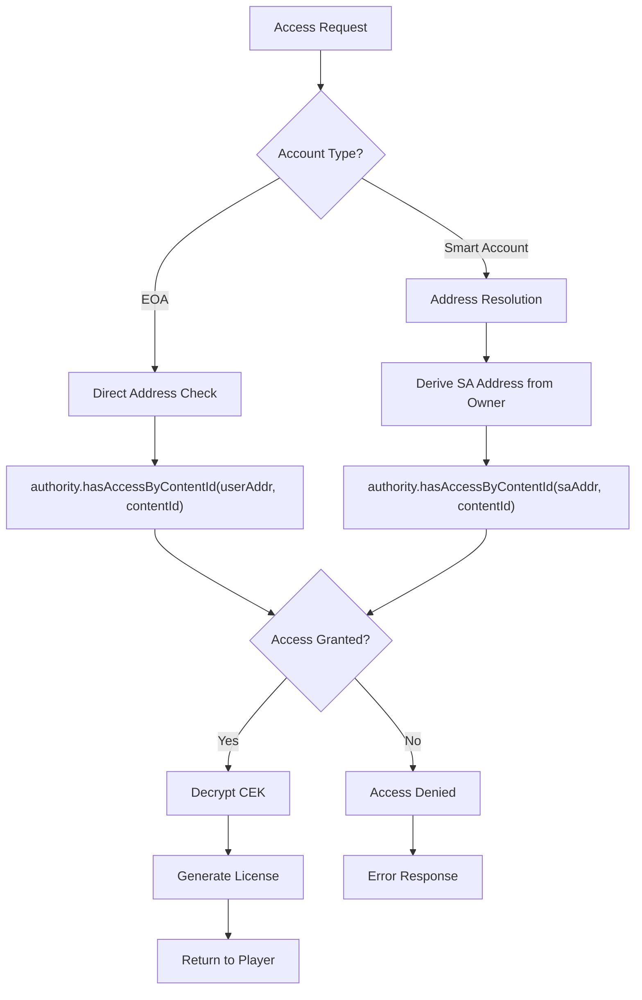

### Cryptographic Protection Layers

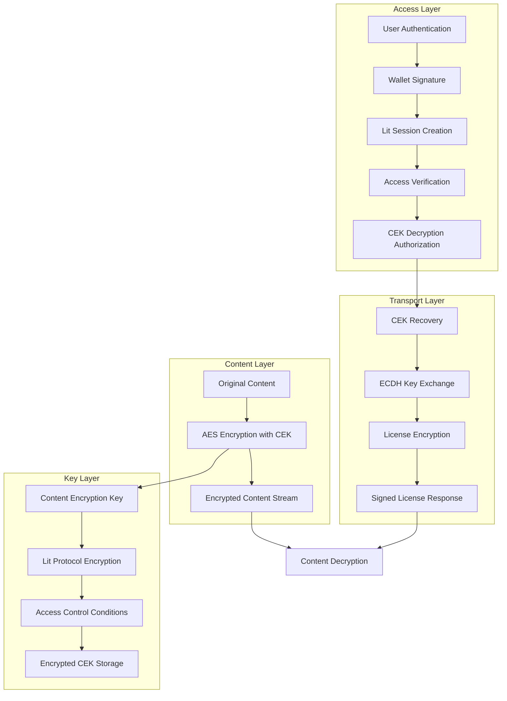

## Configuration Mapping

### System Identifiers and IPFS Mappings

| Component | EOA | Smart Account |
| --- | --- | --- |
| **KeySystemId** | `CencDRM_LitV1` | `CencDRM_LitSAV1` |
| **ProtectionType** | `cenc:lit-drm-v1` | `cenc:lit-drm-sa-v1` |
| **Action IPFS ID** | `QmQgw91ZjsT1VkhxtibNV4zMet6vQTtQwL4FK5cRA8xHim` | `QmWDBNCk1xHk8giLn1cxFrBke7aPFTuXsMDsnn9Pom1wZu` |
| **Access Check IPFS ID** | `QmVdU5MhsQg5mhZNNmp3qx3bbuGw6FPrUGws1yUycY9vsS` | `QmayEHFfJiZbryYyCsUUEu4drhhDM4FkmxM6RZMcy67zHP` |

## Error Handling Across Systems

### Error Propagation Flow

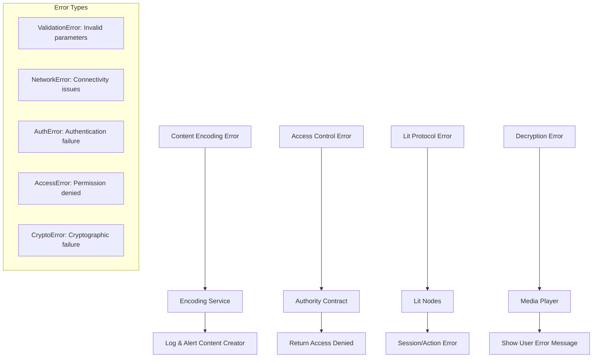

### Error Recovery Mechanisms

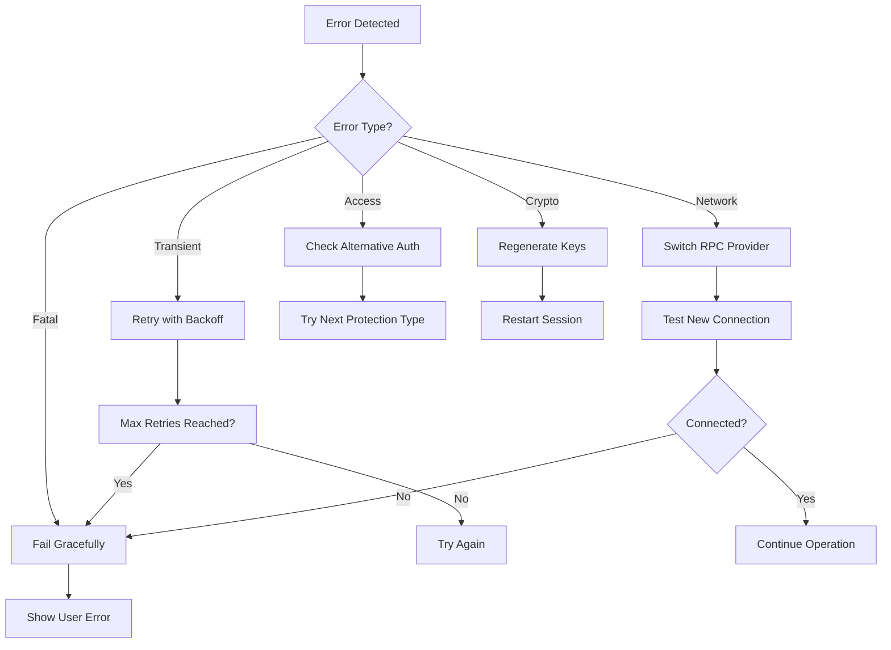

## Monitoring and Observability

### Key Metrics to Track

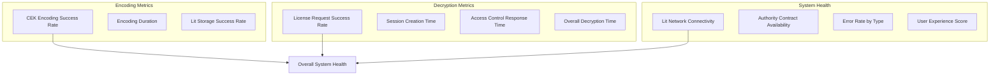

## Security Best Practices

### Development Guidelines

1. **Input Validation**: Always validate all parameters before processing
2. **Error Handling**: Never expose sensitive information in error messages
3. **Key Management**: Use secure random generation and proper key rotation
4. **Access Control**: Implement defense in depth with multiple verification layers
5. **Monitoring**: Log security events and monitor for suspicious activities

### Deployment Considerations

1. **Network Security**: Use HTTPS/WSS for all communications
2. **Contract Verification**: Verify all smart contract addresses before deployment
3. **Rate Limiting**: Implement rate limiting to prevent abuse
4. **Backup Systems**: Maintain fallback mechanisms for critical components
5. **Update Management**: Keep all dependencies and protocols up to date

## Testing Strategy

### Integration Testing Approach

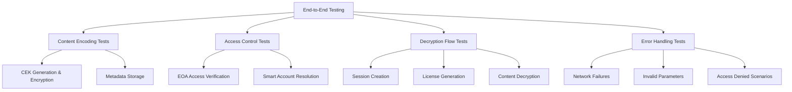

### Test Scenarios

1. **Happy Path Tests**
    - EOA content encoding and decryption
    - Smart Account content encoding and decryption
    - Multi-chain scenarios
2. **Error Scenarios**
    - Network connectivity issues
    - Invalid access control parameters
    - Expired sessions
    - Unsupported protection types
3. **Performance Tests**
    - High-throughput encoding
    - Concurrent decryption requests
    - Large content handling
4. **Security Tests**
    - Unauthorized access attempts
    - Parameter injection attempts
    - Session hijacking scenarios

## Future Roadmap

### Planned Enhancements

1. **Performance Improvements**
    - Session caching and reuse
    - Batch license generation
    - Optimized cryptographic operations
2. **Feature Extensions**
    - Additional blockchain network support
    - Enhanced access control conditions
    - Offline license generation
3. **Developer Experience**
    - Improved documentation and examples
    - SDKs for popular programming languages
    - Enhanced debugging tools
4. **Enterprise Features**
    - Advanced analytics and reporting
    - Multi-tenant support
    - Custom integration options

## Conclusion

The end-to-end content protection flow represents a sophisticated, secure, and scalable solution for digital content protection. By combining the robust CEK encoding capabilities of lit-keystore-moleculer with the flexible decryption workflow of the media-player, the system provides comprehensive protection while maintaining usability and performance. The architecture’s support for both EOA and Smart Account scenarios, combined with strong error handling and monitoring capabilities, makes it suitable for production deployment across various use cases and blockchain networks.