# Media Player Decryption Workflow Documentation

## Overview

This document provides a comprehensive technical overview of the decryption workflow in the media-player project, focusing on how encrypted content is decrypted using the Lit Protocol for both Externally Owned Accounts (EOA) and Smart Accounts.

## Architecture Overview

The media player implements a sophisticated DRM system that supports multiple protection types:

- **`cenc:web3-drm-v1`**: Web3-based DRM protection
- **`cenc:lit-drm-v1`**: Lit Protocol DRM for Externally Owned Accounts (EOA)
- **`cenc:lit-drm-sa-v1`**: Lit Protocol DRM for Smart Accounts

## Complete Decryption Flow

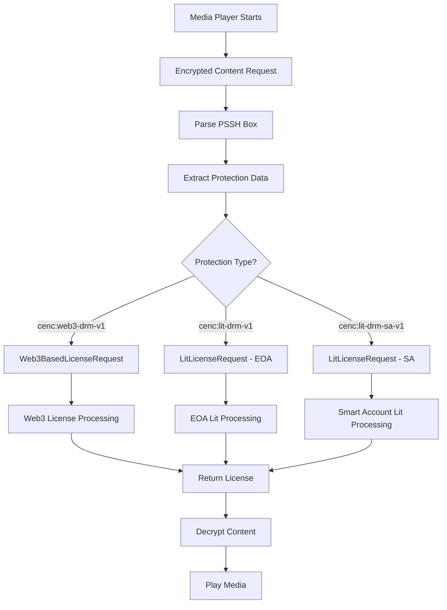

## License Request System

### Main Entry Point

The `LicenseRequest` class serves as the central coordinator:

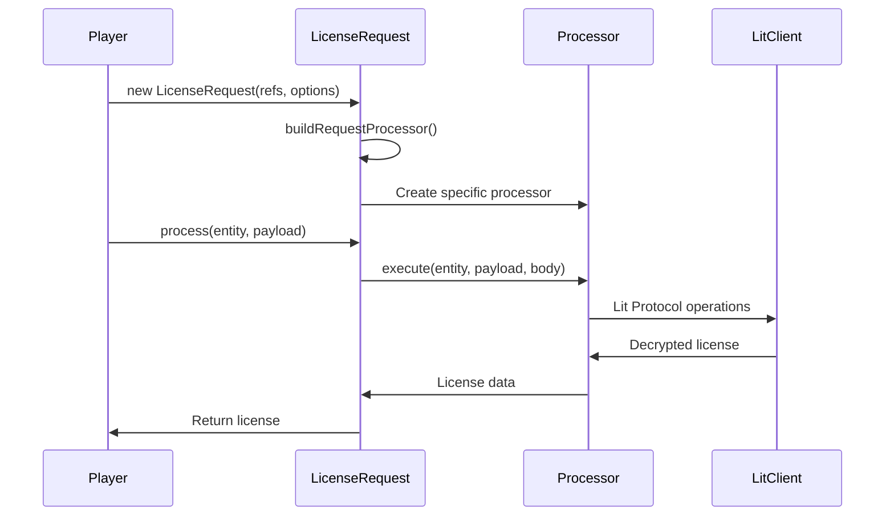

### Account Type Selection Logic

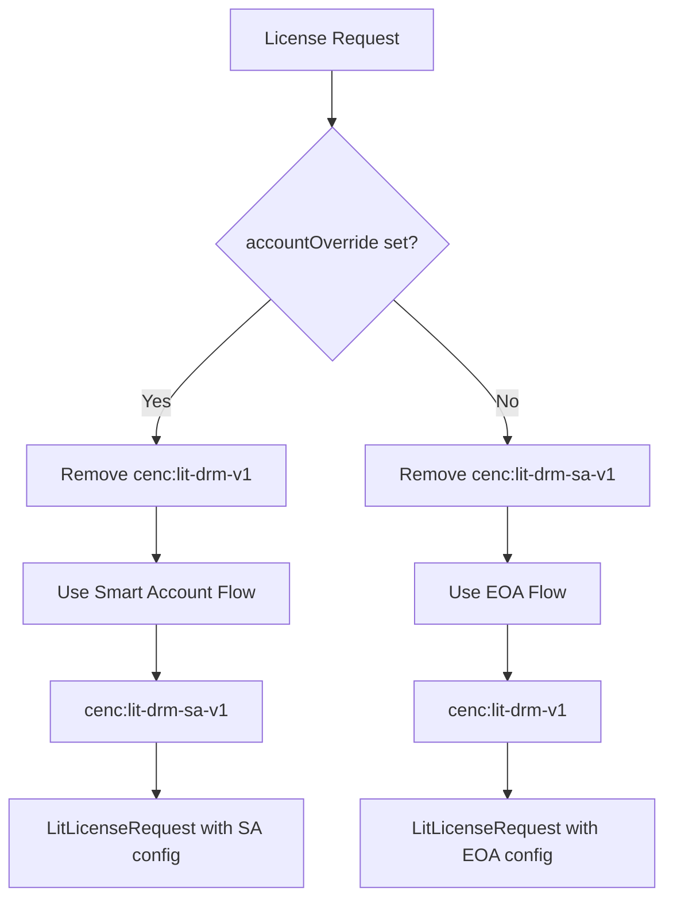

## Lit Protocol Decryption Workflow

### 1. Initialization Phase

```mermaid
graph TD
    A[LitLicenseRequest.execute()] --> B[Validate Protection Type]
    B --> C{Provider Available?}
    C -->|No| D[Check Certificate]
    C -->|Yes| E[Web3 Connect]
    D --> F{Certificate Valid?}
    F -->|No| G[Throw UnrecoverableError]
    F -->|Yes| H[Continue with Certificate]
    E --> I[Validate Network Chain]
    I --> J[Check Lit Protocol Support]
    J --> K{Authority Supports Lit?}
    K -->|No| L[Throw AlternatePathError]
    K -->|Yes| M[Initialize Lit Client]
    H --> M
    G --> N[End: Error]
    L --> N
    M --> O[Create Session]
```

### 2. Web3 Connection Process

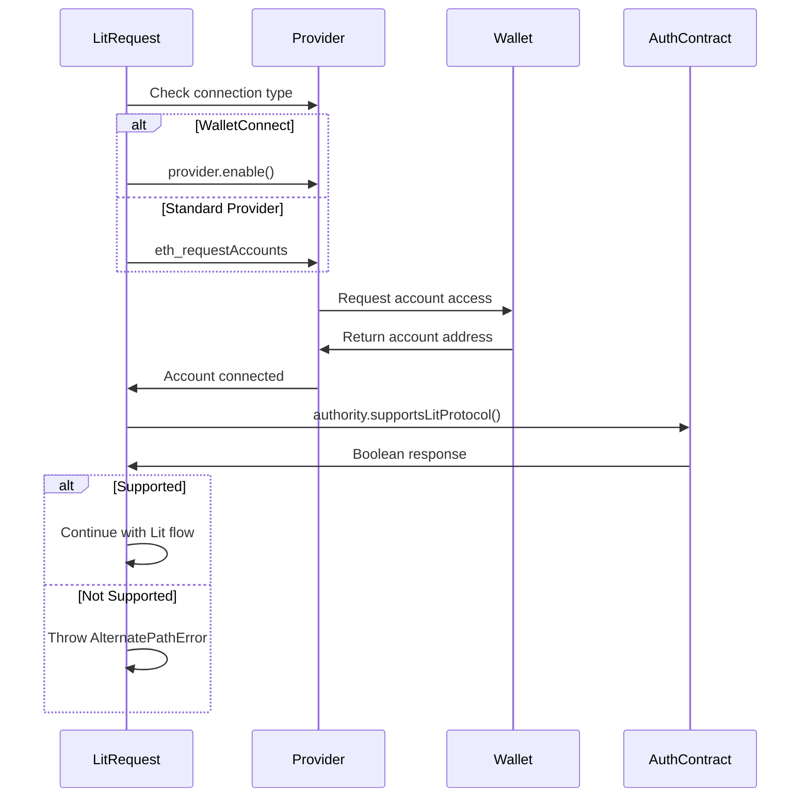

### 3. Lit Protocol Session Creation

```mermaid
flowchart TD
    A[createSession()] --> B[Initialize Lit Client]
    B --> C[Connect to Lit Network]
    C --> D[Get Signer from Provider]
    D --> E[Get Network Chain ID]
    E --> F[Create Resource Ability Requests]
    F --> G[Generate Session Signatures]
    
    G --> H[authNeededCallback]
    H --> I[Create SIWE Message]
    I --> J[Sign Message with Wallet]
    J --> K[Generate Auth Signature]
    K --> L[Return Session Signatures]
    
    L --> M[Store Current Session]
    M --> N{Session Valid?}
    N -->|Yes| O[Session Ready]
    N -->|No| P[Throw Session Error]
```

### 4. License Issuance Process

```mermaid
graph TD
    A[issueLicenseFor()] --> B[Check Current Session]
    B --> C{Session Exists?}
    C -->|No| D[Create Session]
    C -->|Yes| E[Extract Protection Data]
    D --> E
    
    E --> F[Parse Body Data]
    F --> G[Execute Lit Action]
    G --> H[Lit Action: Decrypt CEK]
    H --> I[Lit Action: Access Check]
    I --> J[Lit Action: Generate License]
    J --> K[Return Base64 License]
    K --> L[Convert to Binary Buffer]
```

## Access Control Verification

### EOA Access Control

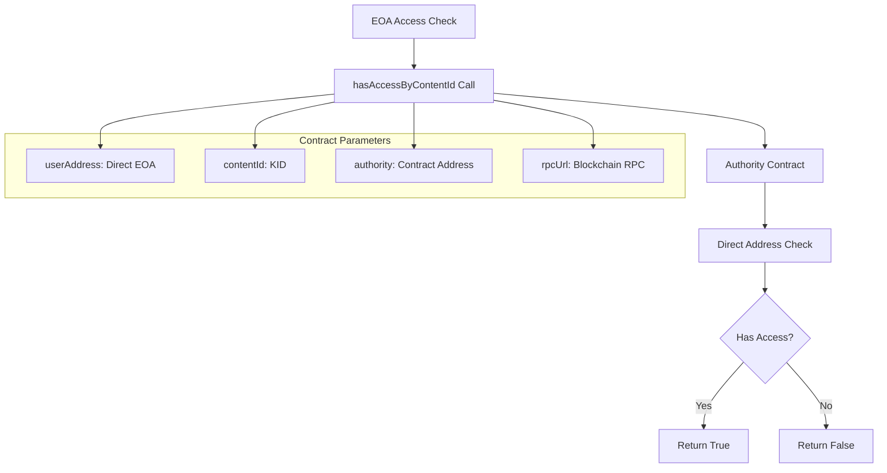

### Smart Account Access Control

```mermaid
flowchart TD
    A[Smart Account Access Check] --> B[resolveSmartAccountAddress()]
    B --> C[Get Network Chain ID]
    C --> D[Lookup Factory & EntryPoint]
    D --> E{Contracts Available?}
    E -->|No| F[Use Owner Address Directly]
    E -->|Yes| G[Build Init Data]
    
    G --> H[Create Call Data]
    H --> I[Make eth_call to Factory]
    I --> J[Extract Derived Address]
    J --> K[hasAccessByContentId Call]
    F --> K
    
    K --> L[Authority Contract Check]
    L --> M{Smart Account Has Access?}
    M -->|Yes| N[Return True]
    M -->|No| O[Return False]
    
    subgraph "Smart Account Resolution"
        P[Owner Address]
        Q[Factory Contract]
        R[EntryPoint Contract]
        S[Derived SA Address]
    end
```

## Lit Action Execution Flow

The core decryption logic happens in the Lit Action (`lit-action-transfer.js`):

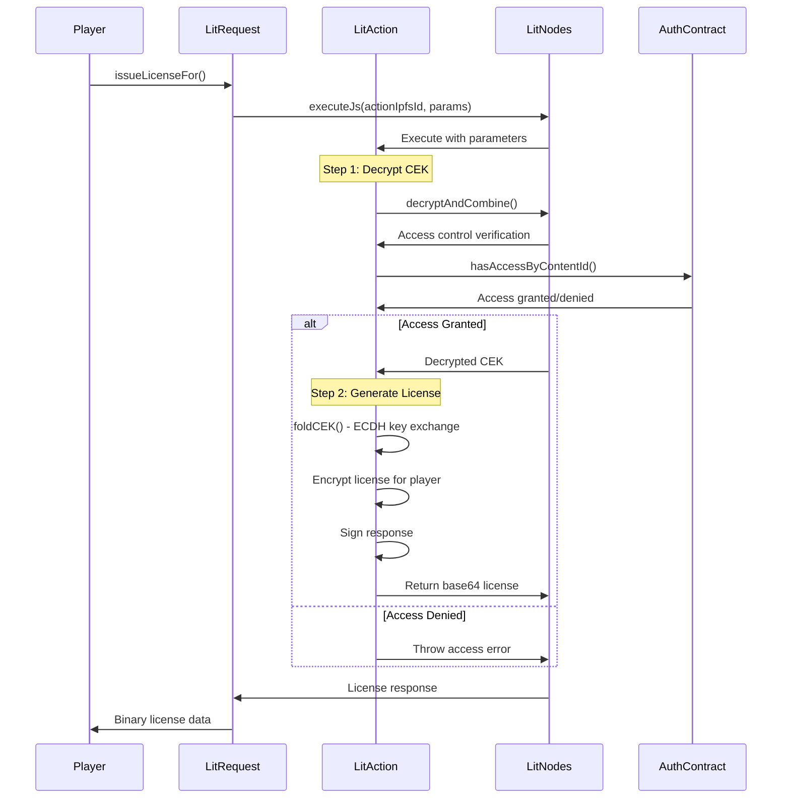

## Cryptographic Operations in Lit Action

### CEK Decryption and License Generation

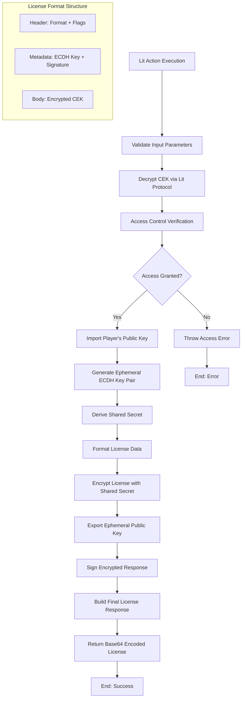

### ECDH Key Exchange Process

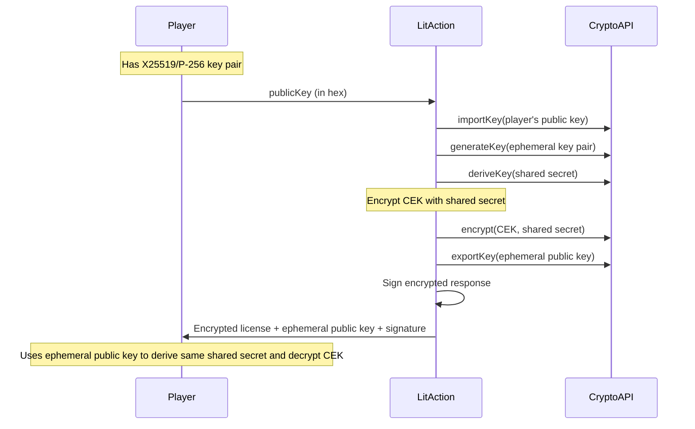

## Error Handling and Fallback Mechanisms

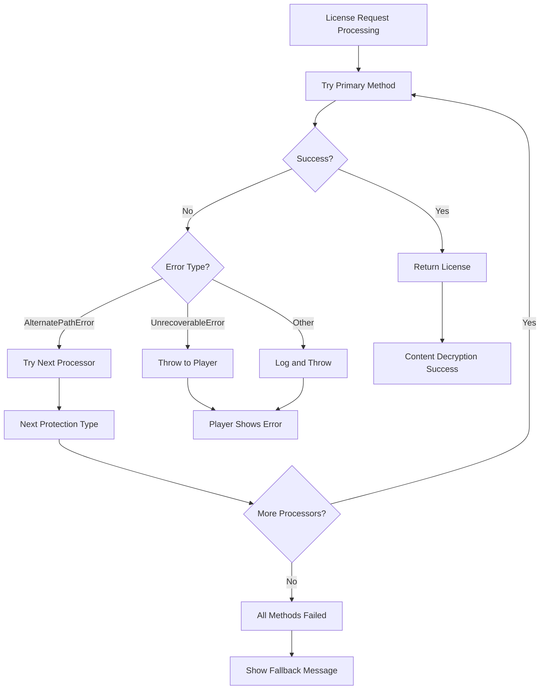

## Network and Chain Support

### Supported Networks

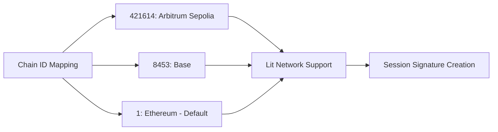

### Smart Account Contract Addresses

| Chain ID | Network | Factory Contract | EntryPoint Contract |
|----------|---------|------------------|-------------------|
| 8453 | Base | `0xb3f15a44f91a08a93a11c6fbf6a4933c623275fe` | `0xba418fa699622de824b258c61eb150ed7a13967b` |

## Performance Characteristics

### Typical Operation Timing

```mermaid
gantt
    title Media Player Decryption Timeline
    dateFormat X
    axisFormat %s

    section Initialization
    PSSH Parsing        :0, 50
    Protection Type ID  :50, 100
    
    section Web3 Connection
    Wallet Connection   :100, 2000
    Network Validation  :2000, 2200
    Authority Check     :2200, 3000
    
    section Lit Protocol
    Client Initialization :3000, 4000
    Session Creation    :4000, 6000
    
    section License Generation
    Lit Action Execution :6000, 8000
    CEK Decryption      :8000, 9000
    License Encryption  :9000, 9500
    
    section Completion
    License Return      :9500, 10000
    Content Decryption  :10000, 10500
```

### Memory Usage Patterns

- **License Request Instance**: ~1-2KB
- **Lit Client**: ~5-10MB (includes network connectivity)
- **Session Data**: ~2-5KB
- **Cryptographic Operations**: ~1-3KB temporary allocations
- **License Data**: ~500B-2KB depending on key size

## Security Considerations

### Input Validation
1. **Protection Type Validation**: Ensures only supported DRM types are processed
2. **Network Chain Validation**: Verifies wallet is on correct network
3. **Authority Contract Verification**: Confirms contract supports Lit Protocol
4. **Public Key Format Validation**: Validates cryptographic key formats

### Access Control Security
1. **Double Verification**: Both Lit access control and authority contract check
2. **Session Expiration**: Sessions expire after 100 minutes
3. **Chain-Specific Validation**: Network-specific contract addresses
4. **Smart Account Resolution**: Secure derivation of SA addresses from owner

### Cryptographic Security
1. **ECDH Key Exchange**: Secure key agreement for license encryption
2. **Ephemeral Keys**: Fresh key pair for each license request
3. **Digital Signatures**: All responses are cryptographically signed
4. **Secure Random Generation**: High-quality entropy for key generation

## Troubleshooting Guide

### Common Issues

1. **"Authority does not support lit protocol"**
   ```javascript
   // Check authority contract implementation
   const authority = new ethers.Contract(authorityAddr, [
     "function supportsLitProtocol() pure returns (bool)"
   ], provider);
   const supported = await authority.supportsLitProtocol(); // Should return true
   ```

2. **"Wrong network" error**
   ```javascript
   // Ensure wallet is on correct chain
   const { chainId: providerChainId } = await provider.getNetwork();
   if (chainId !== Number(providerChainId)) {
     // Switch network or show error
   }
   ```

3. **"Session creation failed"**
   ```javascript
   // Check capacity delegation and session parameters
   const sessionSigs = await client.getSessionSigs({
     chain: chainSupportedMap[chainId] || "ethereum",
     expiration: new Date(Date.now() + 1000 * 60 * 100).toISOString(),
     // ... ensure all required parameters are present
   });
   ```

4. **Smart Account address resolution fails**
   ```javascript
   // Verify factory and entry point contracts are available
   const { factory, entryPoint } = contractsAddr[Number(chainId)] || {};
   if (!factory || !entryPoint) {
     // Fallback to owner address
   }
   ```

### Debug Information

Enable comprehensive logging:
```javascript
// In media player
player.options.debug = true;

// In Lit client
const client = new LitNodeClient({
  litNetwork: network,
  debug: true
});
```

Expected log sequence:
```
[LIT] executing license request
[LIT] checking lit protocol support
[LIT] creating lit session
[LIT] executing lit action
[LIT] license generation complete
```

## Integration with Media Player

### Content Decryption Flow

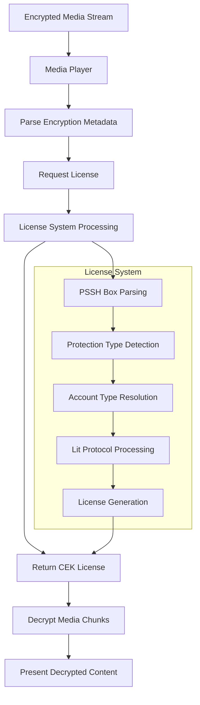

## Future Enhancements

### Potential Improvements

1. **Caching Layer**: Cache Lit sessions and authority validations
2. **Batch Processing**: Support multiple license requests simultaneously
3. **Offline Support**: Pre-generated licenses for offline playback
4. **Multi-Chain**: Extended support for additional blockchain networks
5. **Performance Optimization**: Reduce session creation overhead

### Extensibility Points

1. **Custom Access Control**: Pluggable access verification logic
2. **Additional Key Algorithms**: Support for more cryptographic algorithms
3. **License Format Extensions**: Support for additional DRM formats
4. **Provider Abstraction**: Support for additional wallet providers

## Conclusion

The media player's decryption workflow provides a comprehensive, secure, and extensible solution for content protection using the Lit Protocol. The architecture successfully handles both EOA and Smart Account scenarios while maintaining strong security guarantees and providing robust error handling. The system's modular design allows for easy extension and customization while ensuring compatibility with existing DRM standards.
